# 04. QA レポート（2026-09-06）

再構成後の LP を Playwright（Chrome headless）で 3 言語 × 3 画面幅（1440 / 820 / 390）撮影し、
確認・修正した記録。スクリーンショットは `docs/qa/` に格納。

## 検証環境

- `npm run build` → `next start`（本番ビルド）
- `tsc --noEmit` / `eslint --max-warnings=0` ともにエラー・警告なし
- ブラウザコンソールの `error` はゼロ、全画面幅で横スクロール（`scrollWidth > innerWidth`）なし

## 確認結果

| 章 | PC (1440) | Tablet (820) | Mobile (390) | 備考 |
| --- | --- | --- | --- | --- |
| Hero | OK | OK | OK | ロゴ・キャッチ・CTA。3 言語で改行崩れなし |
| 壱 宣言 | OK | OK | OK | 縦書き stagger、英語は横書き small-caps にフォールバック |
| 弐 こだわり | OK | OK | OK | 和紙テクスチャの継ぎ目を解消（後述） |
| 参 品書き | OK | OK（横スワイプ） | OK（横スワイプ） | sticky 横スクロール、進捗線 |
| 四 体験 | OK | OK | OK | 進捗で線描 → トッピング → 金の光。工程の灯りも連動 |
| 五 お米 | OK | OK | OK | |
| 六 空気 | OK | OK | OK | 仮素材 2 枚を差し替え（後述） |
| 七 道 | OK | OK | OK | 墨線地図、CTA、Instagram |
| Footer | OK | OK | OK | 落款、章ナビ、KanjiVG クレジット |
| Header | OK | OK | OK | 和紙の幕で light、墨・漆黒で dark に追従 |
| 暖簾メニュー | — | — | OK | |

## QA で見つけて修正した点

| # | 症状 | 原因 | 修正 |
| --- | --- | --- | --- |
| 1 | `InkReveal` の本文が左右で切れたまま止まる | マスク SVG が `xMidYMid meet` で等倍拡大されるため、横長要素では円が端まで届かなかった | `--ink-blob` に `preserveAspectRatio='none'` を付与し、要素の縦横比で引き伸ばす |
| 2 | 和紙テクスチャに 480px のタイル境界が見える | 低周波ノイズをタイル画像として敷いていた | `WashiTexture` をインライン SVG に変え、領域全体へ 1 つの `feTurbulence`（繊維 + 粒）を適用 |
| 3 | 金箔がヘッダーの上に重なる | `GoldLeafCanvas` の z-index（65）がヘッダー（50）より上 | z-40 に変更 |
| 4 | モバイルで金箔が過密 | 画面面積に関係なく最大 90 枚 | 画面面積比で最大枚数をスケール |
| 5 | 七 道の金 CTA が 3 行に折り返す | 横並びコンテナの幅不足 | `GoldButton` のラベルを `whitespace-nowrap`、行を `flex-wrap` |
| 6 | 四 体験のキャプション「スクロールで、モンブランが育ちます」が最後まで消えない | `motion.p` の `style` に渡した MotionValue が再レンダー後に反映されない事象 | 工程 index（state）に基づく `animate` へ変更 |
| 7 | 四 体験の器が進捗 0 で見えない／ノズルがヘッダーに隠れる | 器の初期 opacity 0、SVG の上端がヘッダー直下 | 初期 opacity 0.35、`lg:mt-10 lg:max-h-[74vh]` |
| 8 | 工程マーカーが「器 / 絞る / 3 / 撮る」と不揃い | タイトルの文字数で分岐していた | 章番号と同じ筆文字数字（壱弐参四）に統一 |
| 9 | お米クリームの山が疎ら、器から浮く | 48 本・基底が縁より上 | 84 本・細め、最下層を縁にかける |
| 10 | 品書きカードの上端がヘッダーに接する | sticky の中央揃えにヘッダー分の余白なし | `pt-14` を追加 |
| 11 | 仮素材が不適切（誕生日ケーキ、電線の写る通り、結婚式受付） | Commons の検索結果をそのまま採用 | Mont Blanc à Tokyo（CC0）、祇園の石畳・新橋通の町家（CC BY-SA 4.0）に差し替え |
| 12 | Wikimedia の 429 / 400 で `next/image` の最適化が失敗 | リモート取得 + 許可外サムネイルサイズ | 仮素材を `public/img/placeholder/` に同梱（許可サイズ 1280/1920px で取得）、出典を `CREDITS.md` に記録 |

## スクリーンショット

PC:

| | |
| --- | --- |
| 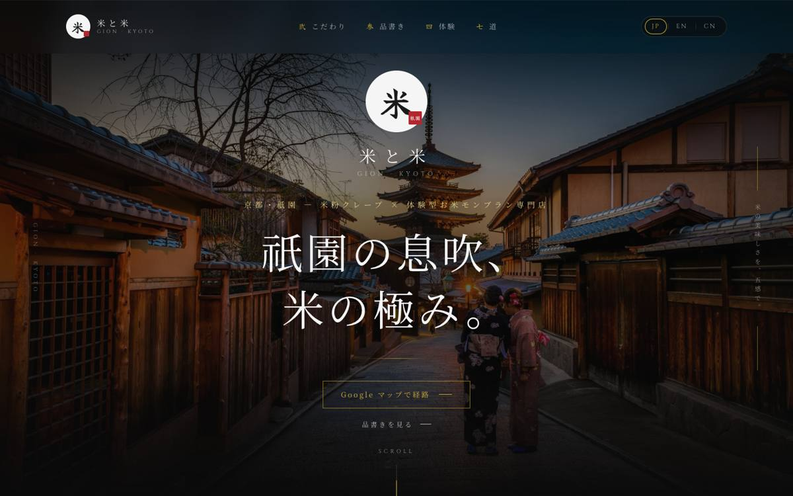 | 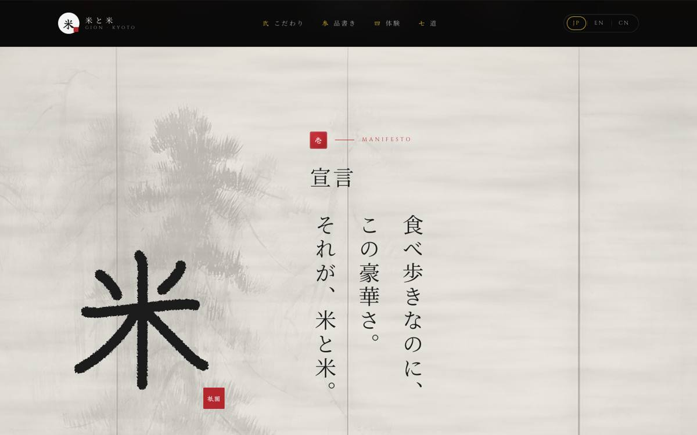 |
| 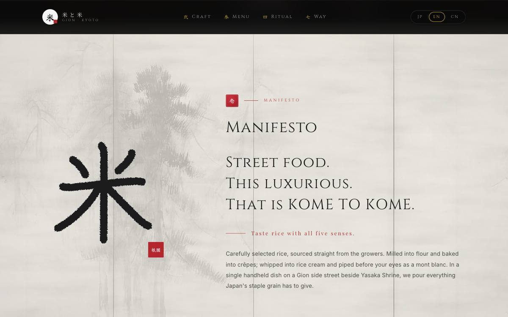 | 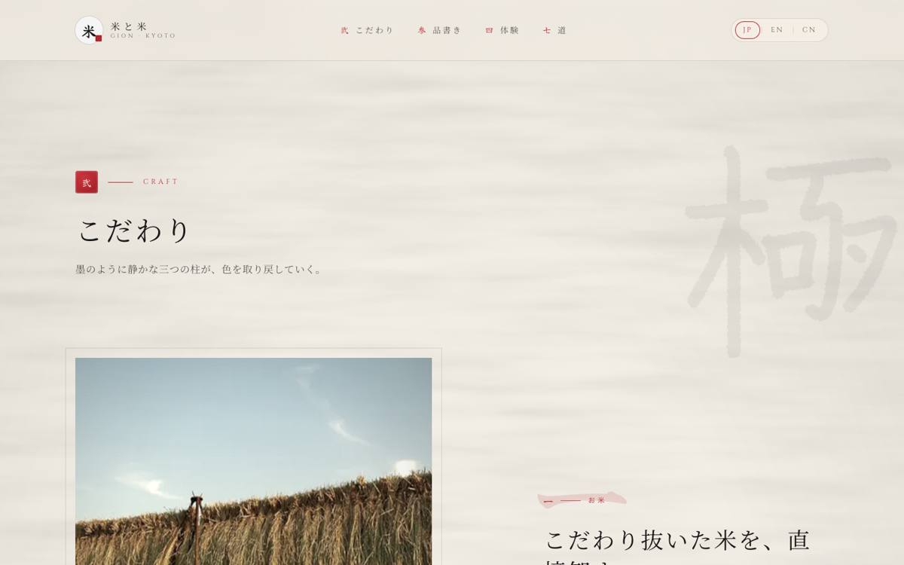 |
| 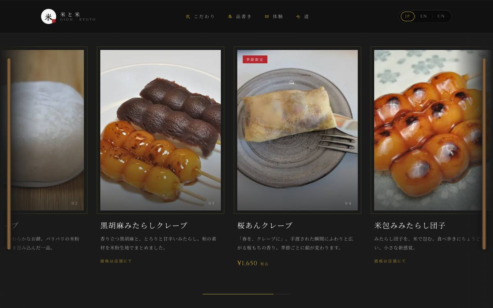 | 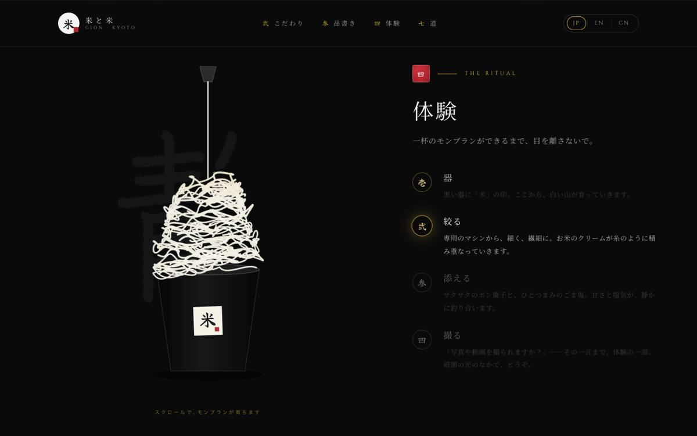 |
| 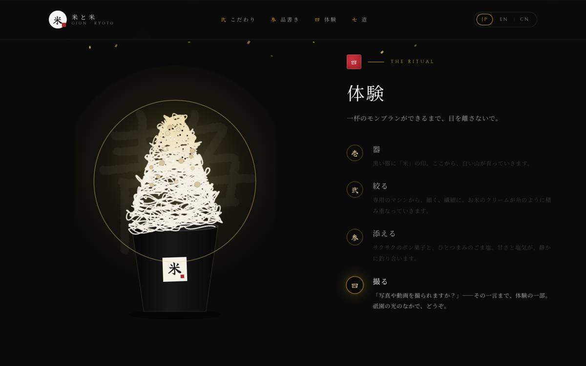 | 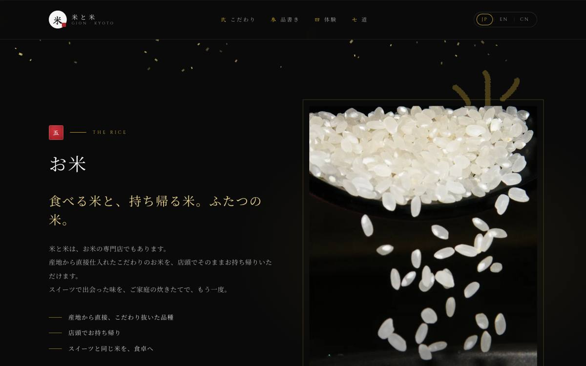 |
| 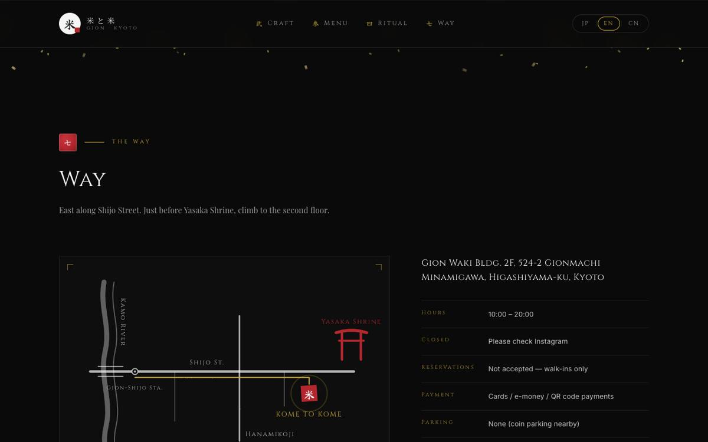 | 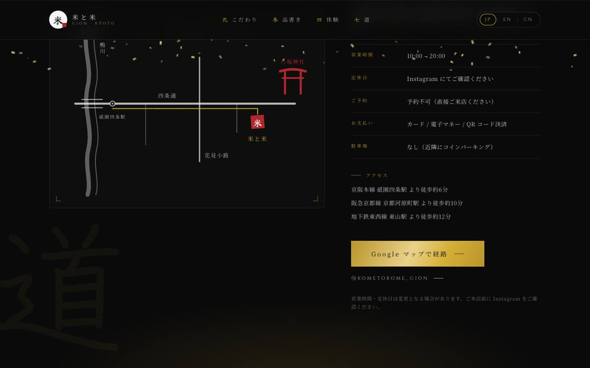 |
| 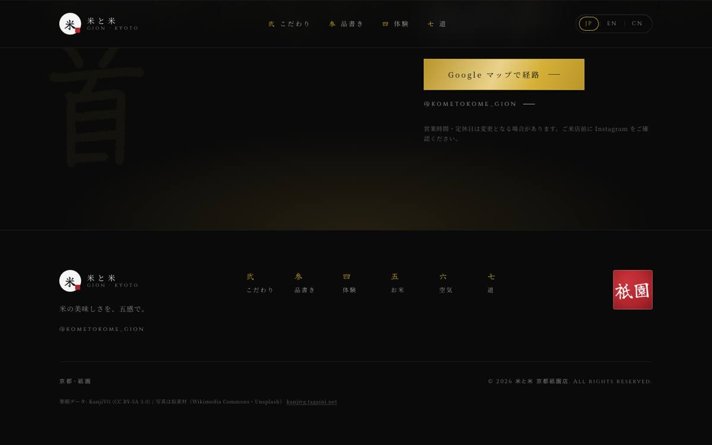 | 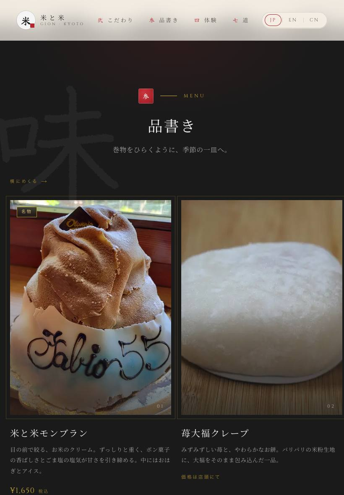 |

Mobile（390px）:

| | | | |
| --- | --- | --- | --- |
| 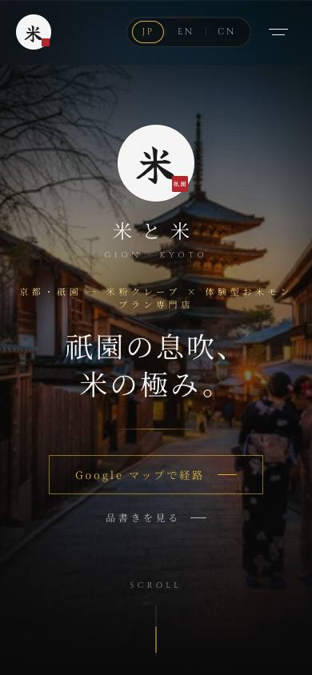 | 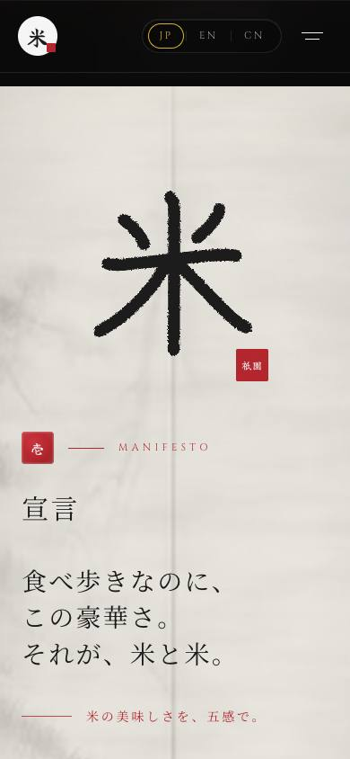 | 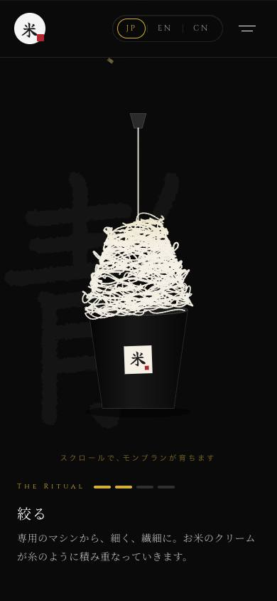 | 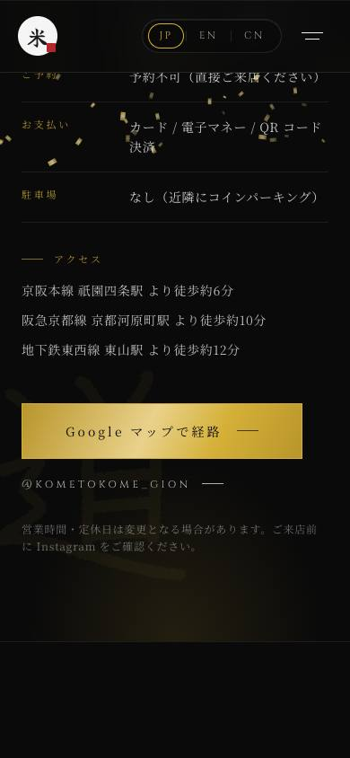 |

## 未実施・持ち越し

- Lighthouse（性能 / a11y）— 実写真差し替え後に計測（仮素材のサイズが最終と異なるため）
- 実機（iOS Safari / Android Chrome）での sticky・`mask-image`・`mix-blend-mode` の確認
- 英語・中国語コピーのネイティブチェック
- 和紙の幕（壱・弐）は `feTurbulence` を大面積に掛けるため、低速端末で初回描画が重い可能性 → 問題があれば `numOctaves` を下げる
